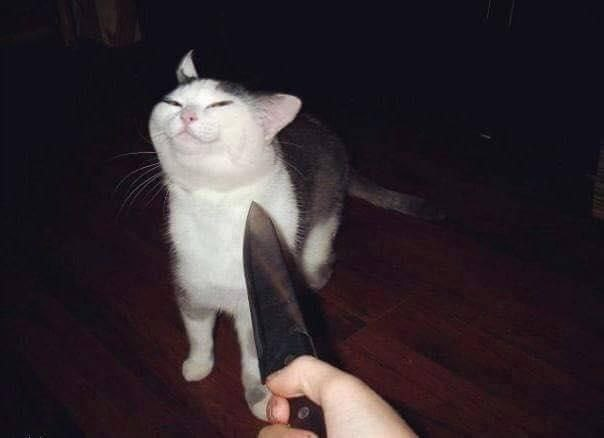
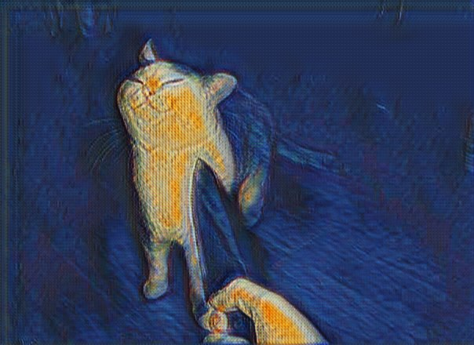
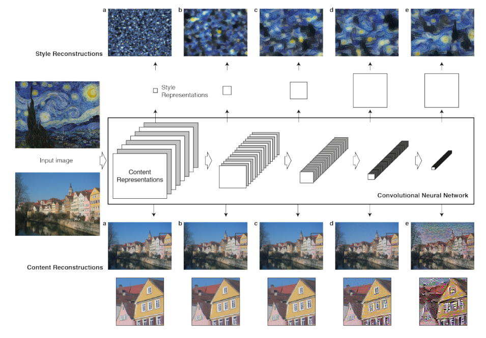
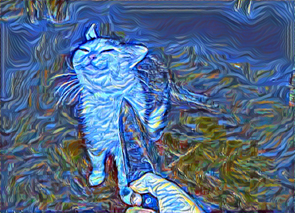
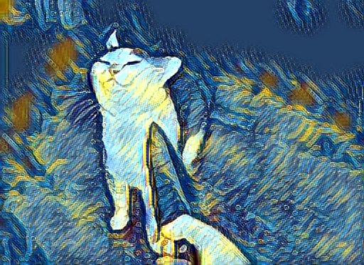
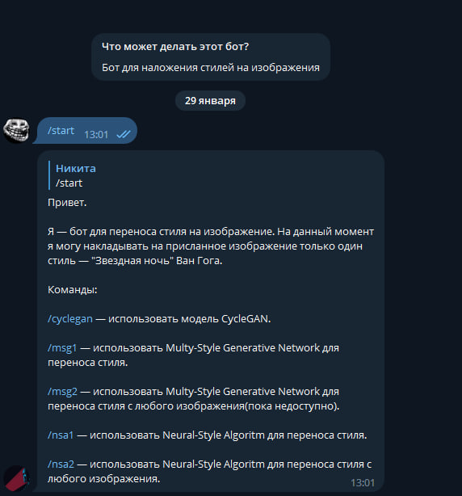
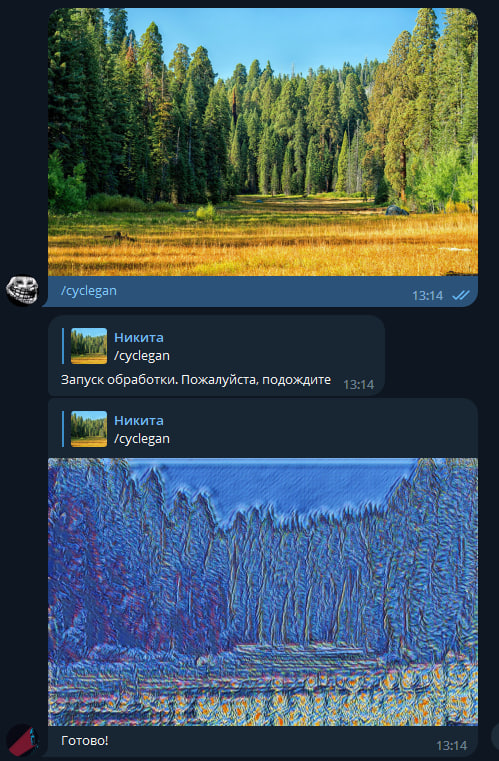
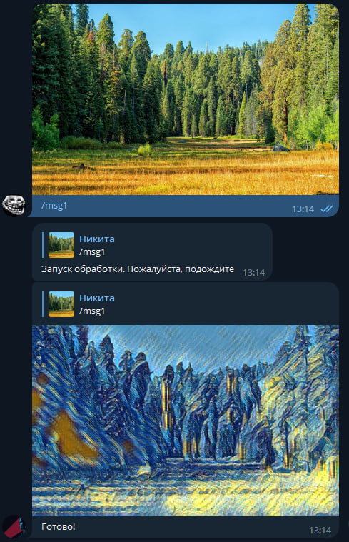
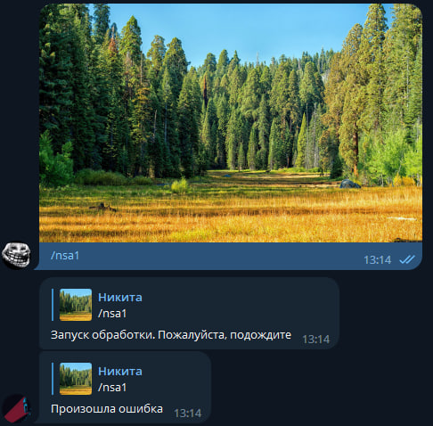

# StyleTransferTelegramBot
Телеграм-бот, производящий наложение стиля на присланное пользователем изображение.

Телеграм-бот может работать с тремя моделями: CycleGAN, Neural-Style algorithm и Multi-style Generative Network

## Требования
Библиотека | Версия
---|---
aiogram | 2.24
Pillow | 9.4.0
torch | 1.13.1
torchvision | 0.14.1

## Запуск
Сначала, необходимо клонировать репозиторий проект на свою машину

```bash
git clone https://github.com/BuldakovN/StyleTransferTelegramBot.git
```

Затем, нужно перейти в появившуюся папку и выполнить установку зависимостей
```bash
cd StyleTransferTelegramBot
pip3 install -r requirements.txt
```

После, необоходимо создать файл **TOKEN**, записать туда токен телеграм-бота и поместить в папку bot. В папке **bot** должно быть три файла:
   bot.py
   config.json
   TOKEN

После этого, нужно запустить скрипт бота
```bash
python3 bot/bot.py
```

---
## CycleGAN
Источник:  [Unpaired Image-to-Image Translation using Cycle-Consistent Adversarial Networks](https://arxiv.org/abs/1703.10593)

GitHub: [CycleGAN](https://github.com/junyanz/CycleGAN)

Архитектура модели:


Эта генеративно-соревновательная модель обучается переводить изображения из одного домена в другой.

Данная модель натренирована на наложение стиля картины "Звездная ночь":
 

### Пример


---
## Neural-Style algorithm
Источник:  [A Neural Algorithm of Artistic Style](https://arxiv.org/abs/1508.06576)

Архитектура:



Этот алгоритм использует уже обученную сверточную модель (например, VGG19). Данный алгоритм, получая на вход изображение, итерационно изменяет его так, чтобы используемая сеть давала минимальную ошибку стиля (StyleLoss) и контента (ContentLoss), т.е., изменяются не параметры сети, а само изображение.

Из-за того, что преобразование требует большое количество вычислений (каждое изображение проходит ~300 итераций), рекомендуется использовать эту модель только на GPU.

### Пример


---
## Multi-style Generative Network
Источник: [Multi-style Generative Network for Real-time Transfer](https://arxiv.org/pdf/1703.06953.pdf)

GitHub: [Multi-style Generative Network](http://computervisionrutgers.github.io/MSG-Net/)

Архитектура:


Данная сеть может обучаться не на одном стиле, как CycleGAN, а сразу на нескольких. Модель, представленная в боте, обучена на 21 стиле.

### Пример


---

# Бот
Бот доступен по ссылке: https://t.me/BN_style_transfer_bot

Бот поддерживает следующие команды:

    /help или /start — вывести приветствие и список команд

    /cyclegan — использовать модель CycleGAN.

    /msg1 — использовать Multy-Style Generative Network

    /msg2 — использовать Multy-Style Generative Network для переноса стиля с любого изображения (пока недоступно) 

    /nsa1 — использовать Neural-Style Algoritm

    /nsa2 — использовать Neural-Style Algoritm для переноса стиля c любого изображения (пока недоступно)"

К сожалению, бот пока не поддерживает получение сразу двух изображений, из-за чего недоступны переносы пользовательских стилей. Кроме того, ввиду очень требовательных вычислений для **Neural-Style algorithm**, его рекомендуется использовать только на машинах, поддерживающих GPU.

## Пример работы бота
Начало работы



Работа с CycleGAN



Работа с MSG



Работа с NSA (недоступно в связи с тем, что на ВМ нет GPU)


